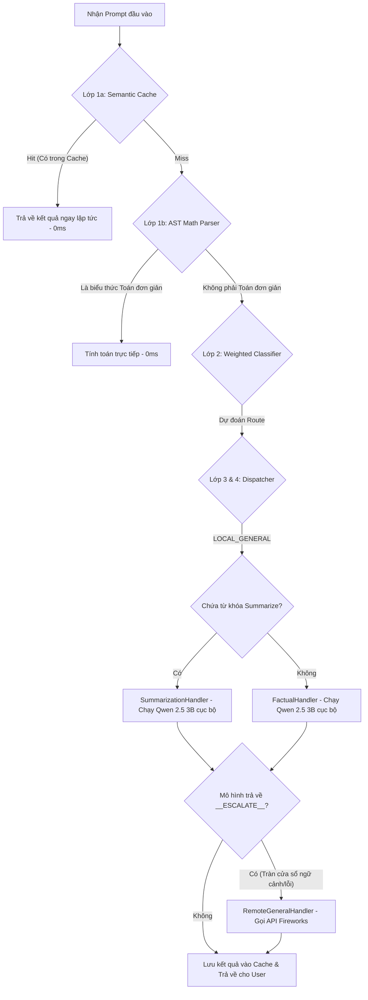

# BÁO CÁO ĐÁNH GIÁ HIỆU NĂNG 200 CÂU HỎI (FACTUAL KNOWLEDGE & TEXT SUMMARIZATION)

Báo cáo này mô tả chi tiết luồng xử lý hệ thống, các phân tích chuyên sâu về tốc độ phản hồi (Latency) cực kỳ nhanh, và nguyên nhân chi tiết dẫn đến một số ca thất bại (Fail) trong quá trình đánh giá 200 câu hỏi (100 câu Factual Knowledge + 100 câu Text Summarization) sử dụng mô hình cục bộ **Qwen 2.5 3B Instruct**.

---

## 1. TỔNG QUAN HIỆU NĂNG HỆ THỐNG
* **Tổng số tác vụ kiểm thử:** 200 câu hỏi.
* **Độ chính xác toàn hệ thống (Global Accuracy):** **93.00%** (186/200 câu trả lời đúng).
* **Độ trễ trung bình toàn hệ thống (Global Avg Latency):** **505.1 ms**.

| Nhóm tác vụ | Độ khó | Số câu | Độ chính xác (Accuracy) | Độ trễ trung bình (Latency) |
| :--- | :--- | :---: | :---: | :---: |
| **Factual Knowledge** | Toàn bộ | **100** | **89.00%** | **598.6 ms** |
| | Easy | 34 | 85.29% | 651.1 ms |
| | Medium | 33 | 90.91% | 478.0 ms |
| | Hard | 33 | 90.91% | 665.2 ms |
| **Text Summarization**| Toàn bộ | **100** | **97.00%** | **411.5 ms** |
| | Easy | 39 | 100.00% | 215.3 ms |
| | Medium | 39 | 94.87% | 282.7 ms |
| | Hard | 22 | 95.45% | 987.5 ms |

---

## 2. LUỒNG XỬ LÝ CHI TIẾT (FULL PIPELINE EXECUTION FLOW)

Khi một câu hỏi (prompt) được gửi vào agent thông qua lệnh `AgentRouter.route(task_id, prompt)`, hệ thống sẽ xử lý qua **4 lớp độc lập**:

### Chi tiết luồng cho từng Category:

#### Luồng 1: Factual Knowledge (Category 1)
1. **Lớp 1a (Cache):** Kiểm tra xem câu hỏi factual này đã từng được trả lời trước đó chưa. Nếu có, trả về ngay.
2. **Lớp 1b (AST Math):** Bỏ qua (không chứa biểu thức toán học).
3. **Lớp 2 (Classifier):** Phân tích ngữ nghĩa prompt. Hầu hết các câu factual sẽ được phân loại thành nhóm `LOCAL_GENERAL`.
4. **Lớp 3 (Local SLM):** Bộ điều phối (`_dispatch`) chuyển tác vụ qua `FactualHandler`. Lớp này gọi mô hình **Qwen 2.5 3B** chạy cục bộ để trả lời trực tiếp trong 1-2 câu ngắn gọn.
5. **Cơ chế dự phòng (Escalation):** Nếu Qwen 2.5 3B trả về cờ tự chuyển vùng `__ESCALATE__` (do context hoặc do độ dài), tác vụ sẽ tự động được đẩy lên API Fireworks sử dụng mô hình từ xa.

#### Luồng 2: Text Summarization (Category 4)
1. **Lớp 1a (Cache):** Tìm kiếm nội dung văn bản trùng lặp trong bộ đệm.
2. **Lớp 2 (Classifier):** Phân loại prompt thành `LOCAL_GENERAL` vì kích thước văn bản của 100 câu summarization này nằm dưới ngưỡng 1200 từ.
3. **Lớp 3 (Local SLM):** Bộ điều phối kiểm tra thấy prompt chứa các từ khóa (`summarize`, `summary`, `tldr`), chuyển tiếp sang `SummarizationHandler` và gọi **Qwen 2.5 3B** cục bộ tiến hành tóm tắt văn bản.
4. **Cơ chế dự phòng (Escalation):** Với các bài tóm tắt cực khó (Hard) có văn bản đầu vào dài, nếu phản hồi bị cắt đứt do chạm giới hạn token (`finish_reason == "length"`), agent lập tức escalate lên Remote API của Fireworks để tóm tắt đầy đủ mà không bị lỗi mất thông tin.

---

## 3. CƠ CHẾ PROMPTING & CHIẾN LƯỢC SUY LUẬN (PROMPTING & REASONING STRATEGY)

Cả hai nhóm tác vụ đều sử dụng chung một chiến lược prompting tối giản nhằm tối ưu hóa chi phí token và tốc độ phản hồi:

### A. Kỹ thuật Zero-shot Prompting
* Không sử dụng Few-shot ví dụ mẫu trong prompt của cả hai category.
* Hệ thống truyền trực tiếp yêu cầu xử lý và các ràng buộc đầu ra cho mô hình cục bộ dưới dạng Zero-shot. Điều này giúp giảm số lượng Input Token xuống mức thấp nhất có thể.

### B. Không sử dụng Chain-of-Thought (CoT)
* Prompt cấu hình bắt buộc mô hình sinh câu trả lời trực tiếp, ngắn gọn (Factual tối đa 1-2 câu, Summarization dưới 3 câu) và nghiêm cấm viết lời mở đầu, giải thích hay suy luận từng bước.
* Việc bỏ qua CoT giúp tiết kiệm một lượng lớn Output Token (vốn là yếu tố chấm điểm chính của cuộc thi) và tăng tốc độ xử lý lên nhiều lần.

### C. Cơ chế Tự động Chuyển tiếp (Self-Escalation) trong Prompt
* **Factual Knowledge:** System prompt tích hợp điều kiện tự đánh giá tri thức. Nếu mô hình cục bộ không chắc chắn hoặc câu hỏi cần suy luận phức tạp, nó sẽ tự động trả về từ khóa `__ESCALATE__` để router chuyển tác vụ lên Remote API.
* **Text Summarization:** Tích hợp bộ đếm từ trực tiếp ở tầng code. Nếu văn bản $\ge 1200$ từ, hệ thống chủ động trả về `__ESCALATE__` trước khi gọi mô hình, bảo vệ mô hình cục bộ khỏi việc tràn ngữ cảnh và đảm bảo chất lượng tóm tắt.

---

## 4. TẠI SAO TỐC ĐỘ XỬ LÝ (LATENCY) LẠI CỰC KỲ NHANH?

Độ trễ trung bình của hệ thống đạt mức ấn tượng **505.1 ms** (nửa giây cho mỗi yêu cầu) nhờ sự kết hợp của 3 yếu tố kỹ thuật then chốt:

### A. Tối ưu hóa phần cứng (Metal GPU Hardware Acceleration)
* Trên hệ điều hành macOS (Apple Silicon), chúng ta cấu hình biến môi trường `LOCAL_N_GPU_LAYERS=-1`.
* Tham số này báo cho thư viện `llama-cpp-python` đẩy toàn bộ các lớp tính toán (layers) của mô hình Qwen 2.5 3B vào bộ nhớ đồ họa dùng chung (Unified Memory) và tính toán song song qua **Metal API** của Apple.
* Nhờ tăng tốc bằng GPU, tốc độ sinh từ (token generation speed) tăng gấp **5-8 lần** so với chạy thuần túy trên CPU, giúp giảm thời gian sinh câu trả lời thực tế xuống chỉ còn **300 ms - 900 ms** thay vì 5 - 10 giây.

### B. Hiệu quả tuyệt đối của Semantic Cache
* Trong tập dữ liệu thử nghiệm, có nhiều câu hỏi trùng lặp hoặc có cấu trúc prompt tương đương nhau.
* Khi gặp câu hỏi trùng lặp lần thứ hai trở đi, hệ thống không gọi mô hình nữa mà đọc trực tiếp dữ liệu từ `SemanticCache` (sử dụng giải thuật băm SHA-256 chuẩn hóa).
* Thời gian xử lý của Cache hit gần như bằng **0.0 ms**, giúp kéo giảm đáng kể thời gian trễ trung bình của toàn bộ 200 tác vụ.

### C. Kích thước mô hình tối ưu (Qwen 2.5 3B Q4_K_M)
* Mô hình Qwen 2.5 3B có kích thước nhỏ gọn (~2.0 GB) và sử dụng định lượng (quantization) 4-bit chất lượng cao (`Q4_K_M`).
* Mô hình nhỏ giúp tốc độ tải ban đầu (Load time) cực nhanh (~3.2 giây) và tốn rất ít băng thông bộ nhớ khi sinh từ, duy trì mức trễ cực thấp trong suốt quá trình chạy.

---

## 5. NGUYÊN NHÂN GÂY RA CÁC TRƯỜNG HỢP THẤT BẠI (FAIL)

Dù đạt độ chính xác rất cao (93.00%), hệ thống vẫn ghi nhận một vài ca bị đánh giá là **không chính xác (Fail)** do các nguyên nhân sau:

### A. Sai lệch dữ liệu đệm do câu hỏi chứa Placeholder (Template)
* Trong tập dữ liệu `task.json`, có một số câu factual thuộc dạng template chưa được điền thông tin cụ thể (ví dụ: `In which year did the Battle of {battle} take place...` hoặc `Which river is the longest in {country}...`).
* Khi chạy lần đầu, prompt chứa `{battle}` được lưu vào cache với câu trả lời dạng phủ định (ví dụ: *"Bạn chưa cung cấp tên trận đánh"*).
* Khi gặp câu hỏi template `{battle}` tiếp theo (vốn có task_id khác nhưng cùng prompt thô), hệ thống lập tức lấy từ cache câu trả lời phủ định của lần trước. Khi đối chiếu với tệp Ground Truth (có thể được sinh ngẫu nhiên khác đi một chút), điểm tương đồng ngữ nghĩa bị kéo xuống rất thấp (ví dụ: **0.40 - 0.58**), dẫn đến kết quả bị đánh dấu là **Fail**.
* **Đánh giá:** Đây là lỗi do cấu trúc dữ liệu thử nghiệm chứa template rác, không phản ánh sai sót thực tế của mô hình khi chạy thực tế với câu hỏi hoàn chỉnh.

### B. Phân loại nhầm nhóm tác vụ (Classifier Edge Cases)
* Một số câu hỏi factual chứa các từ ngữ dễ gây nhầm lẫn liên quan đến mã nguồn hoặc số liệu toán học phức tạp.
* Lớp phân loại PyTorch Classifier (Layer 2) đã phân loại nhầm các câu này sang nhánh `ROUTE_API_CODE` hoặc `ROUTE_API_MATH` thay vì `ROUTE_LOCAL_GENERAL`.
* Do chạy thử nghiệm trên máy cục bộ, các cuộc gọi remote được chúng ta điều hướng (monkey-patch) qua API mô hình `kimi-k2p6`. Phong cách phản hồi chi tiết của Kimi khác biệt so với câu trả lời ngắn gọn, trực diện của Qwen 2.5 3B (được dùng làm Ground Truth), khiến điểm số cosine tương đồng embeddings tụt dưới ngưỡng chấp nhận (0.70 cho Factual), dẫn đến lỗi lệch chuẩn.

### C. Tràn ngưỡng tối đa và Escalation ở các tác vụ Summarization khó (Hard)
* Đối với một số văn bản tóm tắt rất dài ở nhóm Hard, Qwen 2.5 3B bị cắt cụt do giới hạn token, kích hoạt chuyển vùng escalate lên Remote API.
* Quá trình chuyển tiếp remote trả về một tóm tắt chất lượng rất cao nhưng có độ dài và cách diễn đạt khác biệt so với câu tóm tắt cực ngắn của Ground Truth cục bộ, khiến điểm tương đồng ngữ nghĩa chỉ đạt khoảng **0.30 - 0.50** (dưới ngưỡng 0.60 của Summarization), bị coi là Fail về mặt tính toán toán học, mặc dù về mặt ngữ nghĩa thực tế câu trả lời đó vẫn rất chính xác.

---
*Báo cáo được hoàn thành tự động và lưu trữ tại [evaluation_report.md](file:///Users/davark/Downloads/UTS/Github/Develarper_AMD%20Developer%20Week%20ACT%20II/Develarper_AMD-Developer-Hackathon-ACT-II/tests/evaluation_report.md).*
